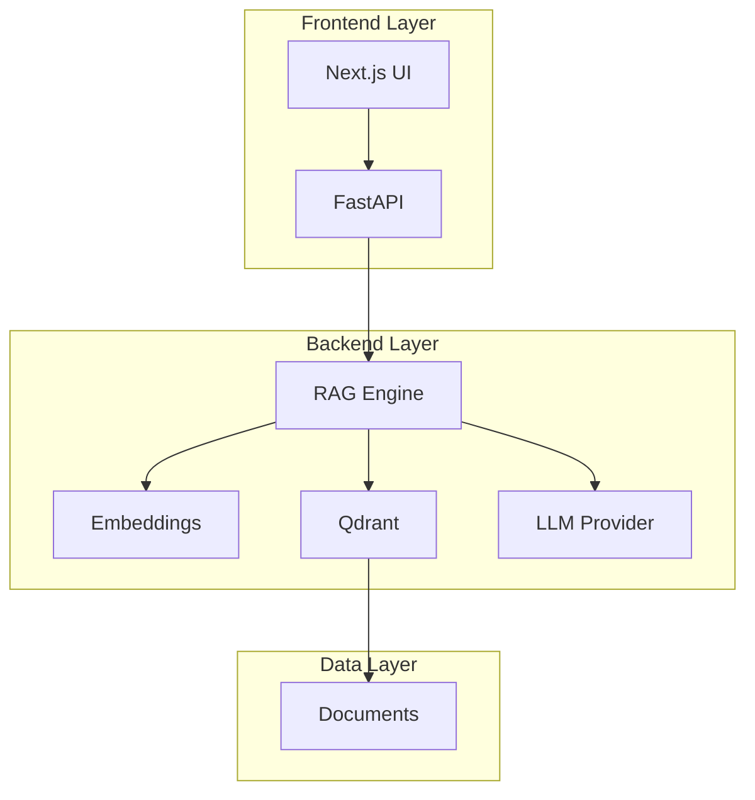

# 🚀 Developer Guide

## 🎯 Quick Start

### Prerequisites
- Docker & Docker Compose
- Node.js 18+ (for local frontend development)
- Python 3.11+ (for local backend development)
- Git

### One-Command Setup
```bash
# Clone and setup
git clone <repository-url>
cd ai-policy-helper-starter-pack
cp .env.example .env

# Start everything
docker compose up --build

# 🎉 Open http://localhost:3001
```

## 🛠️ Development Workflow

### Local Development Setup

**Backend Development:**
```bash
# Terminal 1: Start backend with hot reload
cd backend
python -m venv .venv
source .venv/bin/activate
pip install -r requirements.txt
uvicorn app.main:app --host 0.0.0.0 --port 8000 --reload --app-dir .

# Terminal 2: Start vector store
docker compose up -d qdrant

# Terminal 3: Run tests in watch mode
cd backend
python -m pytest app/tests/ -v --watch-files
```

**Frontend Development:**
```bash
# Terminal 1: Start frontend with hot reload
cd frontend
npm install
npm run dev  # http://localhost:3000

# Terminal 2: Start backend (if not already running)
docker compose up -d backend qdrant
```

### 🧪 Testing

**Run all tests:**
```bash
# All tests
docker compose run --rm backend pytest -v

# Unit tests only
docker compose run --rm backend pytest app/tests/test_api.py -v

# Integration tests
docker compose run --rm backend pytest app/tests/test_end_to_end.py -v

# Performance tests
docker compose run --rm backend pytest app/tests/test_performance.py -v
```

**Test Coverage:**
```bash
# Generate coverage report
docker compose run --rm backend pytest --cov=app --cov-report=html

# View coverage
open htmlcov/index.html
```

## 🔧 Development Tools

### 📊 API Testing

**Using the API directly:**
```bash
# Health check
curl http://localhost:8000/api/health

# Ingest documents
curl -X POST http://localhost:8000/api/ingest

# Ask questions
curl -X POST http://localhost:8000/api/ask \
  -H "Content-Type: application/json" \
  -d '{"query": "What is the shipping SLA to East Malaysia?"}'

# Get metrics
curl http://localhost:8000/api/metrics
```

**Interactive API Playground:**
```bash
# Start interactive Python shell
docker compose run --rm backend python -i -c "
from app.rag import RAGEngine
from app.main import engine

# Test RAG directly
ctx = engine.retrieve('shipping to East Malaysia', k=4)
print('Found', len(ctx), 'chunks')
for chunk in ctx:
    print(f'→ {chunk[\"title\"]} - {chunk[\"section\"]}')
"
```

### 🐛 Debug Mode

**Enable debug logging:**
```bash
# Set environment variable
export ENVIRONMENT=development
export LOG_LEVEL=DEBUG

# Restart services
docker compose up --build
```

**Debug endpoints:**
```bash
# Check vector store contents
curl -X POST http://localhost:8000/api/debug/vector-store \
  -H "Content-Type: application/json" \
  -d '{"query": "test query", "k": 2}'

# Test embedding generation
curl -X POST http://localhost:8000/api/debug/embeddings \
  -H "Content-Type: application/json" \
  -d '{"text": "shipping policy"}'
```

## 🏗️ Architecture Overview

### System Components



### Key Components

| Component | Purpose | Tech Stack |
|-----------|---------|------------|
| **RAG Engine** | Retrieval + Generation | Python + NumPy |
| **Vector Store** | Semantic Search | Qdrant (with in-memory fallback) |
| **LLM Provider** | Answer Generation | OpenAI + Stub fallback |
| **Frontend** | User Interface | Next.js + React |
| **API Layer** | HTTP Endpoints | FastAPI + Pydantic |

## 🔍 Common Development Tasks

### Adding New Documents

1. **Add to data folder:**
```bash
# Create new markdown file
touch data/New_Policy.md
```

2. **Format consistently:**
```markdown
# Document Title
- Section 1: Content here
- Section 2: More content
```

3. **Re-index:**
```bash
curl -X POST http://localhost:8000/api/ingest
```

### Modifying RAG Pipeline

**Change chunking strategy:**
```python
# backend/app/settings.py
CHUNK_SIZE = 500  # Adjust size
CHUNK_OVERLAP = 50  # Adjust overlap
```

**Change retrieval parameters:**
```python
# backend/app/main.py - ask endpoint
ctx = engine.retrieve(req.query, k=req.k or 8)  # Adjust k
```

### Adding New LLM Providers

1. **Create new LLM class:**
```python
# backend/app/rag.py
class OllamaLLM:
    def __init__(self, model="llama2"):
        self.model = model
        # Initialize Ollama client

    def generate(self, query: str, contexts: List[Dict]) -> str:
        # Ollama implementation
        pass
```

2. **Update settings:**
```python
# backend/app/settings.py
LLM_PROVIDER = "ollama"  # Add to options
```

## 🚨 Troubleshooting

### Common Issues

**❌ "CORS errors"**
```bash
# Check CORS origins in logs
docker compose logs backend | grep CORS

# Set proper origins in .env
ALLOWED_ORIGINS=http://localhost:3000,http://localhost:3001
```

**❌ "Qdrant connection failed"**
```bash
# Check Qdrant health
curl http://localhost:6333/health

# Restart services
docker compose restart qdrant backend
```

**❌ "No relevant context found"**
```bash
# Check vector store contents
curl -X POST http://localhost:8000/api/debug/vector-store \
  -H "Content-Type: application/json" \
  -d '{"query": "test", "k": 5}'

# Re-ingest documents if needed
curl -X POST http://localhost:8000/api/ingest
```

**❌ "LLM timeout"**
```bash
# Check OpenAI API key
echo $OPENAI_API_KEY

# Use stub LLM for testing
LLM_PROVIDER=stub docker compose up --build
```

### Debug Commands

```bash
# Check all services
docker compose ps

# View service logs
docker compose logs -f backend
docker compose logs -f frontend

# Enter container for debugging
docker compose exec backend bash
docker compose exec frontend sh

# Monitor resource usage
docker stats
```

## 📈 Performance Monitoring

### Metrics Dashboard

Access metrics at `http://localhost:8000/api/metrics`:

```json
{
  "total_docs": 6,
  "total_chunks": 12,
  "avg_retrieval_latency_ms": 12.3,
  "avg_generation_latency_ms": 2750.8,
  "embedding_model": "local",
  "llm_model": "openai:gpt-4o-mini"
}
```

### Performance Testing

**Load testing:**
```bash
# Install wrk if needed
brew install wrk

# Test API endpoints
wrk -t12 -c4 -d30s http://localhost:8000/api/ask \
  --script=test_post.lua
```

## 🎯 Best Practices

### Code Quality
- **Type hints** for all functions
- **Pydantic models** for data validation
- **Unit tests** for business logic
- **Integration tests** for API endpoints
- **Documentation** for all public APIs

### Security
- **Input validation** on all endpoints
- **Environment variables** for secrets
- **HTTPS** in production
- **Rate limiting** for abuse prevention

### Performance
- **Caching** for repeated queries
- **Connection pooling** for database access
- **Async operations** where possible
- **Resource limits** for memory usage

---

## 📚 Additional Resources

- [API Reference](./API_REFERENCE.md)
- [Deployment Guide](./DEPLOYMENT.md)
- [Architecture Decisions](./ADRs/)
- [Contributing Guidelines](./CONTRIBUTING.md)

**Need help?** Check the [Troubleshooting Guide](./TROUBLESHOOTING.md) or create an issue.